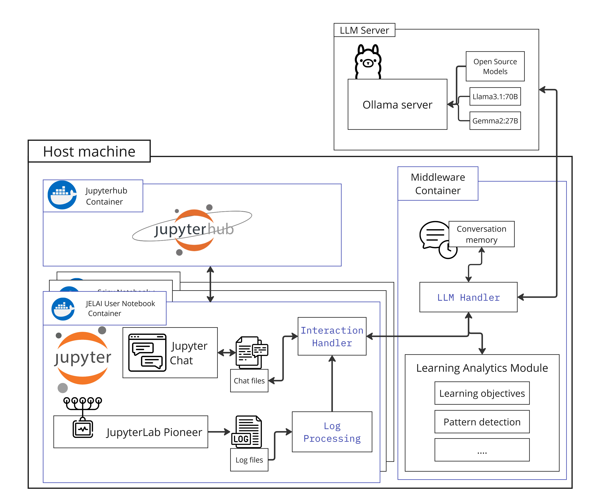

# JELAI: a Jupyter Environment for Learning Analytics and AI
## System Architecture

<a href="https://www.flaticon.com/free-icons/" title="icons" style="font-size: 0.5em;">Icons created by juicy_fish - Flaticon</a>

## Overview
JELAI is a system that integrates a Jupyter environment with a chatbot to provide a learning analytics and AI platform. 
The system is designed to support education using Jupyter notebooks, such as programming, data science and machine learning, by providing a collaborative environment where students can interact with Jupyter notebooks and receive assistance from a chatbot. 
The chatbot uses a large language model (LLM) to provide responses based on the chat history and their actions as they work through the notebooks. 
JELAI is intended to help students learn and explore, get feedback on their work, and receive guidance on problem-solving.
For instructors, the system can provide insights into student interactions with the notebooks, allowing them to monitor progress, identify areas where students may need help, and provide targeted support.
For researchers, the system can be used to collect data on student interactions and explore the use of LLMs in educational settings.

Table of Contents:
- [Description](#description)
- [Setup and Configuration](#setup-and-configuration)
- [Development and Local Experimentation](#development-and-local-experimentation)

### Description
The system consists of a JupyterHub server, individual user Jupyter servers, a middleware server, and an Ollama server. 
- The JupyterHub server (containerized, running in the `jupyterhub-docker` Docker network) handles user authentication and management of individual user servers.
- The **individual user** Jupyter servers are automatically created (or *spawned*) when a user is created in the JupyterHub server (each user has their own container, which is connected to the `jupyterhub-docker` Docker network)
    - The user notebooks are based on the [Scipy-notebook](https://github.com/jupyter/docker-stacks/tree/main/images/scipy-notebook) image, including common packages for data science and machine learning.
    - The [Jupyterlab-pioneer](https://pypi.org/project/jupyterlab-pioneer/) Extension logs telemetry data from the user's interactions with the notebook.
    - The [Jupyter-chat](https://github.com/jupyterlab/jupyter-chat) Extension is used to integrate a chat interface into the notebook.
    - The `chat_interact.py` script in the notebook image is used to interact with the LLM-handler server by watching the chat files for changes and sending the messages to the server.
    - The `process_logs.py` script in the notebook image processes the telemetry logs from the JupyterLab-Pioneer extension to create a JSON file with the processed logs for each notebook.
- The **middleware** container runs the backend services:
    - The Tutor Agent (`ta-handler.py`) receives student messages, orchestrates calls to the Expert Agent and the LLM, manages student profiles, and maintains chat history using an SQLite database (`chat_histories` volume).
    - The Expert Agent (`ea-handler.py`) provides concise, factual technical information based on context provided by the TA.
    - Both agents are started via the `start.sh` script.
    - The LA module (in progress) processes telemetry logs to generate insights.
- **Fluent** is used to collect logs from the individual containers and send them to the middleware container for storage and processing with the LA module.
- The **Ollama** server can run locally in the host machine or on a separate one. Cloud or third-party services can also be used, but the system is designed to work with a self-hosted server. 

## Setup and Configuration
This setup has was developed and tested on Ubuntu 22.04 and 24.04. 

### Prerequisites
- Docker
- Docker Compose
- Python 3.11 or above

### Quick Start
Build and run the JupyterHub server using docker compose. This will create a JupyterHub instance using the latest image from the JupyterHub Docker Hub repo (quay.io/jupyterhub/jupyterhub) with the volume **jupyterhub-data** to persist data for individual users and a network **jupyterhub-network** to allow communication between the JupyterHub server, the individual user servers, and the chatbot server.
- Clone this repository to your local machine
- Run the Ollama server (see below)
- **Configure the middleware environment:**
    - Navigate to the `jupyterhub-docker/middleware` directory.
    - Copy the example environment file: `cp .env.example .env`
    - Edit the new `.env` file with a text editor.
    - Set `ollama_url` to the correct address of your Ollama server (e.g., `http://localhost:11434` if running locally).
    - *(Optional)* If using an OpenAI-compatible WebUI instead of or alongside Ollama, uncomment and set `webui_url` and `webui_api_key`. Providing a `webui_api_key` will make the system prefer the WebUI.
    - *(Optional)* Uncomment and set specific model names if you don't want to use the defaults (`gemma3:4b`).
- Go back to the **jupyterhub-docker** directory in the terminal
- Run `docker compose build` to build the containers
- Run `docker compose up -d` to start the container in detached mode.
- Access the JupyterHub server at `http://localhost:8000` in your browser (see *Nginx* below for public access). 
- The default admin user is `admin`, create a new user called admin, with a new password, to access the system.
- To stop the system, run `docker compose down`.

### Pedagogical Configuration
Several aspects of the AI tutor's behavior and context can be configured by editing files in the **jupyterhub-docker/middleware/inputs** directory. Changes to these files take effect immediately for new messages (no container restart needed) when using the production setup with the volume mount.
- **Tutor Agent System Prompt**: `ta-system-prompt.txt` defines the main persona and instructions for the Tutor Agent (Juno).
- **Expert Agent System Prompt**: `ea-system-prompt.txt` defines the specific role and constraints for the Expert Agent.
- **Learning Objectives**: `learning_objectives.txt` lists the course/assignment learning objectives used for context and matching.
- **Assignment Description**: `assignment_description.txt` provides the overall assignment context for the agents.
- **Classification Prompt**: `classification_prompt.txt` instructs the LLM on how to classify student questions (e.g., instrumental vs. executive).
- **Classification Options**: `classification_options.txt` lists the valid classification categories the LLM should use.

### Individual User Servers
The individual user servers are automatically created (or *spawned*) when a user is created in the JupyterHub server. These servers include the necessary configuration for the JupyterLab-Pioneer and Jupyter-Chat extensions to log telemetry data and enable chat functionality in the notebook. The image is built automatically using the Dockerfile in the user-notebook directory.

### User Working Environment
In the Dockerfile in the user-notebook directory, the working directory for the chatbot interaction is set to the **working-directory** environment variable. This is the local directory where students see their notebooks and chat files. 
To add course or experiment materials, the files can be added to the **working-directory** in the user-notebook image.
Additionally, the default directory for chat files can be set in the Dockerfile, for example by setting `{"defaultDirectory": "chats/"}'`.
Check the Dockerfile in the user-notebook directory for more details.

### Chatbot File Watcher
The chat interaction app in **chat_interact.py** watches the chat files for changes and sends the messages to the chatbot server. It automatically runs in the individual containers.
The [Jupyter-chat](https://github.com/jupyterlab/jupyter-chat) extension used to limit exploration to the JupyterLab [root directory](https://github.com/jupyterlab/jupyter-chat/issues/61). 
Now the directory can be specified in the Dockerfile of the user-notebook image, for example by setting ``{"defaultDirectory": "chats/"}'`.

### Ollama Server
For a local LLM server, you can use [Ollama](https://ollama.com/). 
- To run Ollama in one machine and access it from a different one, follow the instructions in the [Ollama server documentation](https://github.com/varunvasudeva1/ollama-server-docs?tab=readme-ov-file) to install and run Ollama as a service.
- To run it locally for experimentation, just install it following the steps in [Ollama](https://ollama.com/). 
- Ollama can also run in a Docker container, so you don't have to install it. To run the Ollama server in a container, run the following command:
    - `docker run -d -p 11434:11434 ollama/ollama:latest`
Performance will depend on the host server's capability, we have achieved acceptable responses with basic conversations in English using Gemma3:4b and Llama3.2 (pretty small models) and great answers within 15 seconds with the Llama3.1:70b, Gemma2:27b and Gemma3:27b on an Nvidia A40 GPU. 

Third-party services (cloud LLM providers) have not been evaluated, but in theory, they can be used as long as they provide a REST API for the chatbot server to interact with.

### Nginx Reverse Proxy
To access JupyterHub from outside the local network, follow the official [JupyterHub documentation](https://jupyterhub.readthedocs.io/en/stable/howto/configuration/config-proxy.html#nginx) to set up the Nginx reverse proxy. Similarly, to serve Ollama from a separate machine to the one running JELAI, you can use the Nginx reverse proxy to forward requests to Ollama, see the [Ollama server documentation](https://github.com/ollama/ollama/blob/main/docs/faq.md#how-can-i-use-ollama-with-a-proxy-server) for details.

## FAQ:
- Where can I edit the system prompt for the assistant?
    - The main system prompt for the Tutor Agent (Juno) can be edited in the **jupyterhub-docker/middleware/inputs/ta-system-prompt.txt** file. See the *Pedagogical Configuration* section for other related files.
- Can I add notebooks or materials so they are available to all users?
    - Yes, you can add course materials to the **working-directory** in the user-notebook image, using the Dockerfile.
- What if I can't run Ollama locally?
    - You can use a third-party service that provides a REST API for the chatbot server to interact with. The system is designed to work with a self-hosted server, but other services can be used.

## Development and Local Experimentation
To run the system locally for development and experimentation, you can use **JupyterLab** (instead of JupyterHub) and the chatbot server in your local environment.
For this setup you only need Docker Desktop, it's been tested on iOS and Windows (via WSL). 

For the local Ollama server, see the steps above, if you have access to a webui or ollama server, you can add the info to the **.env**, see below.

- Clone this repository to your local machine
- Run the Ollama server (see above)
- **Configure the middleware environment:**
    - Navigate to the `jupyterhub-docker/middleware` directory.
    - Copy the example environment file: `cp .env.example .env`
    - Edit the new `.env` file with a text editor.
    - Set `ollama_url` to the correct address of your Ollama server (e.g., `http://localhost:11434` if running locally).
    - *(Optional)* If using an OpenAI-compatible WebUI instead of or alongside Ollama, uncomment and set `webui_url` and `webui_api_key`. Providing a `webui_api_key` will make the system prefer the WebUI.
    - *(Optional)* Uncomment and set specific model names if you don't want to use the defaults (`gemma3:4b`).
- Run `docker compose -f 'docker-compose-dev.yml' build` to create all the images
- Run `docker compose -f 'docker-compose-dev.yml' up -d` to start the images
- Run `docker compose -f 'docker-compose-dev.yml' down` to stop them
- If you make changes, like trying a different prompt in the **llm_handler.py** file in the **jupyterhub-docker/middleware** directory, you can rebuild the middleware container only: 
    - Run `docker compose -f 'docker-compose-dev.yml' up -d --build middleware-dev`
- If you make changes to the Python code (e.g., in `ta-handler.py` or `ea-handler.py` in the **jupyterhub-docker/middleware** directory), you need to rebuild the middleware container:
    - Run `docker compose -f 'docker-compose-dev.yml' up -d --build middleware-dev`
- Changes to files in the **jupyterhub-docker/middleware/inputs** directory (like prompts or learning objectives) do **not** require a rebuild in the dev environment; they are reflected immediately because the directory is mounted as a volume.
- Or just do `down` and `up` for the whole thing 

 
### For Step-by-step individual services:
This workflow does not require Docker, but it needs Python 3.11+ and `uv` (for package/project management).
1. Create a virtual environment and install dependencies for the Middleware (TA & EA):
    - Navigate to the Middleware directory: `cd jupyterhub-docker/middleware`
    - `python -m venv .venv` (or your preferred venv name)
    - `source .venv/bin/activate` (on Windows use `.venv\Scripts\activate`)
    - `uv pip install .` (This reads `pyproject.toml` and installs dependencies)
2. On a different terminal, create a venv and install dependencies for JupyterLab:
    - Navigate to the repository root: `cd ../..`
    - `python -m venv .venv-lab`
    - `source .venv-lab/bin/activate` (on Windows use `.venv-lab\Scripts\activate`)
    - `uv pip install jupyterlab notebook` *(Install other necessary lab extensions)*
3. On a third terminal, create a venv and install dependencies for the chat interaction script:
    - Navigate to the user-notebook directory: `cd jupyterhub-docker/user-notebook`
    - `python -m venv .venv-chat`
    - `source .venv-chat/bin/activate` (on Windows use `.venv-chat\Scripts\activate`)
    - `uv pip install -r chat_interact_requirements.txt`
4. Create your environment variables file for the Middleware:
    - Ensure you are in the **jupyterhub-docker/middleware** directory.
    - Create an **.env** file.
    - Add the following line: `ollama_url=http://localhost:11434` (or the address of your Ollama/WebUI server). Add `webui_url` and `webui_api_key` if using WebUI.
5. Run the Middleware services (TA and EA):
    - **Terminal 1 (Middleware venv):** Run the Expert Agent:
        - `uvicorn ea-handler:app --host localhost --port 8003`
    - **Terminal 1a (Another Middleware venv, or run EA in background):** Run the Tutor Agent:
        - `uvicorn ta-handler:app --host localhost --port 8004`
    - *These servers must remain active.*
6. On the terminal running the **chat interaction** environment (from step 3), run the chat handler script:
    - `python chat_interact.py /path/to/your/notebooks/chats /path/to/your/processed/logs`
    - Replace the paths with the actual directories where your chat files will be saved by JupyterLab and where `process_logs.py` outputs its JSON files.
    - *This script must remain active.*
7. Add the jupyterlab-pioneer configuration file:
    - On the terminal with the **JupyterLab** environment, run `jupyter --path`
    - Copy the config file (see the [examples](https://github.com/educational-technology-collective/jupyterlab-pioneer/tree/main/configuration_examples)), named **jupyter_jupyterlab_pioneer_config.py** to the appropriate path. For development, use the **file_exporter** and set the correct path. See the config in **jupyterhub-docker/user-notebook/jupyter_jupyterlab_pioneer_config.py**.
    - You only have to do this once, the configuration will be saved in the JupyterLab configuration directory.
8. On the terminal with the **JupyterLab** environment (from step 2), run JupyterLab:
    - `jupyter lab --notebook-dir=/path/to/your/notebooks`
    - *Ensure the chat extension saves files to the directory monitored in step 6.*
9. To run the experimental log processing script, activate the **chat interaction** environment and run the script:
    - `python process_logs.py path-to-log-file path-to-output-directory`
    - This script will process the logs in the **logs** file (the one configured in step 7 **jupyter_jupyterlab_pioneer_config.py**) and create a JSON file with the processed logs for each notebook in the given directory.
    - For the LLM to see the logs as context, <ins>the notebook and the chat file must have the same name</ins>.